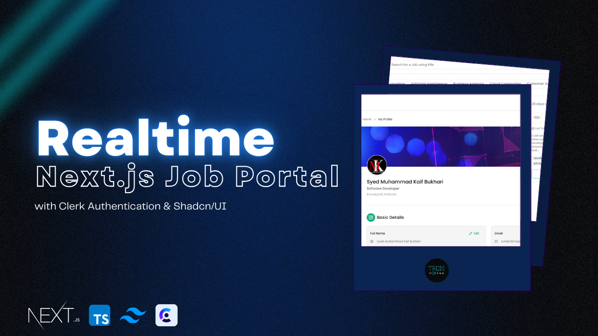

<p align="center" width="100%">
    
</p>

# 🌐 Full-Stack Online Job Portal


*👨‍💻 Developed by:* [Syed Muhammad Kaif Bukhari](https://smkbukhari.netlify.app/)
*🏢 Internship Project at:* [Devsinz](https://www.linkedin.com/company/devsinz)

---

## 🎉 Welcome to the Ultimate Job Portal Experience!

This repository hosts a comprehensive *Full-Stack Online Job Portal* developed as part of my internship at *Devsinz*. It's built to revolutionize the job hunting and recruiting experience with a modern, user-friendly interface and powerful backend capabilities.

---

## 🛠 Built With Cutting-Edge Technologies

- *⚛ Frontend:* [Next.js](https://nextjs.org/) & [ShadCN UI](https://ui.shadcn.com/) for a seamless and responsive user experience.
- *🛢 Backend:* [Prisma](https://www.prisma.io/) ORM & [MongoDB](https://www.mongodb.com/) for robust and scalable data management.
- *🔐 Authentication:* [Clerk](https://clerk.com/) for secure and easy user management with support for social logins.
- *☁ Deployment:* [Vercel](https://vercel.com/) for fast, scalable, and reliable hosting.
- *🤖 AI Integration:* Google Generative AI for smart job descriptions and company profiles.

---

## 🌟 Key Features

### 🔍 Job Search & Application
- *Advanced Filtering:* Find jobs by role, experience level, work schedule, and more.
- *One-Click Applications:* Apply for jobs with a single click and get real-time status updates.

### 🧑‍💼 Profile Management
- *Update Basic Info:* Update User Basic Informations.
- *Resume Management:* Upload and manage multiple resumes.
- *Educations and Experiences Details Management:* Add and Delete Education and Experience Details.
- *Application Tracking:* Keep track of your job applications and follow companies.

### 🏢 Company Profiles
- *Auto-Generated Profiles:* Dynamic company profiles with the latest job postings.
- *Follow Companies:* Stay updated with your favorite companies’ latest job offerings.

### 🛠 Admin Tools
- *Rich Job Posting:* Create, manage, and publish jobs with rich text editing.
- *AI-Assisted Keywords:* Automatically generate relevant keywords for job postings.

---

## 📈 What Makes This Project Unique?

This isn’t just another job portal—it's a feature-rich platform that leverages AI, modern UI/UX design, and a powerful backend to deliver a superior user experience for both job seekers and recruiters.

---

# Demo :movie_camera:



## View live preview [here](https://vendect.vercel.app/).
## Watch live Overview [here](https://youtu.be/UR7WnoS-8SU)

---

## 📂 Explore the Code

Delve into the codebase to discover how the features are implemented. From dynamic frontend components to intricate backend logic and AI integration, there's a wealth of knowledge to be explored.

```bash
# Clone the repository
git clone https://github.com/SMKBukhari/VenDect.git

# Navigate to the project directory
cd VenDect

# Install dependencies
npm install

# Run the development server
npm run dev

# Packages Used :package:

|             Used Package List            |
| :--------------------------------------: |
|       next                               |
|       shadcn/UI                          |
|       @radix-ui/react-checkbox           |
|       @radix-ui/react-dialog             |
|       @radix-ui/react-dropdown-menu      |
|       @radix-ui/react-hover-card         |
|       @radix-ui/react-label              |
|       @radix-ui/react-popover            |
|       @radix-ui/react-select             |
|       @radix-ui/react-separator          |
|       @radix-ui/react-slot               |
|       @radix-ui/react-tabs               |
|       @tanstack/react-table              |
|       class-variance-authority           |
|       lodash                             |
|       @types/lodash                      |
|       nodemailer                         |
|       @types/nodemailer                  |
|       axios                              |
|       clsx                               |
|       cmdk                               |
|       date-fns                           |
|       firebase                           |
|       @clerk/clerk-sdk-node              |
|       @clerk/nextjs                      |
|       @google/generative-ai              |
|       @hookform/resolvers                |
|       @prisma/client                     |
|       prisma                             |
|       query-string                       |
|       mongodb                            |
|       zod                                |
|       react                              |
|       react-day-picker                   |
|       react-dom                          |
|       react-hook-form                    |
|       react-hot-toast                    |
|       react-quill                        |
|       recharts                           |
|       framer-motion                      |
|       handlebars                         |
|       lucide-icons                       |
|       react-toastify                     |
|       tailwindcss                        |
|       tailwind-merge                     |
|       tailwind-scrollbar                 |
|       tailwindcss-animate                |

---
